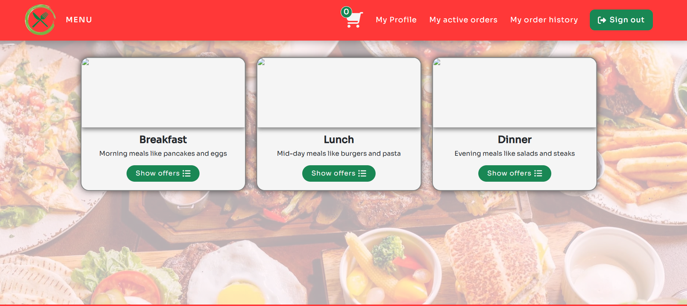

# Food-Order-App
## End-to-End Food-App Application Deployment 
- This is a multi-tier Food-App application written in Java (Springboot).




### PRE-REQUISITES FOR THIS PROJECT:
- AWS Account
- AWS Ubuntu EC2 instance (t2.medium)
- Install Docker
- Install docker compose
#
### DEPLOYMENT:
| Deployments    | Paths |
| -------- | ------- |
| Deployment using Docker and Networking | <a href="#Docker">Click me </a>     |
| Deployment using Docker Compose | <a href="#dockercompose">Click me </a>     |

#
### STEPS TO IMPLEMENT THE PROJECT
- **<p id="Docker">Deployment using Docker</p>**
  - Clone the repository
  ```bash
  git clone 
  ```
  #
  - Install docker, docker compose and provide neccessary permission
  ```bash
  sudo apt update -y

  sudo apt install docker.io docker-compose-v2 -y

  sudo usermod -aG docker $USER && newgrp docker
  ``` 
  #
  - Move to the cloned repository
  ```bash
  cd food-ordering-app/food-ordering-app/food-order-back
  ```
  #
  - Build the Dockerfile
  ```bash
  docker build -t sidraut007/Food-App .
  ```
> [!Important]
> Make sure to change docker build command with your DockerHub username.
  #
  - Create a docker network
  ```bash
  docker network create foodapp
  ```
  #
  - Run MYSQL container
  ```bash
  
  docker run -itd --name mysql -e MYSQL_ROOT_PASSWORD=admin -e MYSQL_DATABASE=foodorderDB --network=foodapp mysql:5.7

  ```
  #
  - Run Application container
  ```bash
  docker run -d -p 80:80 --name frontend --network foodapp sidraut007/food-frontend
  ```

  #
  - Run Application Backend container
  ```bash
  docker run -d -p 8080:8080 --name backend -e SPRING_DATASOURCE_USERNAME="root" -e SPRING_DATASOURCE_URL="jdbc:mysql://mysql:3306/foodorderDB?createDatabaseIfNotExist=true" -e SPRING_DATASOURCE_PASSWORD="admin" --network foodapp sidraut007/food-backend
  ```
  #
  - Verify deployment
  ```bash
  docker ps
  ```
  # 
  - Open port 8080 of your AWS instance and access your application
  ```bash
  http://<public-ip>:8080
  ```
  ### Congratulations, you have deployed the application using Docker 
  #
- **<p id="dockercompose">Deployment using Docker compose</p>**
- Install docker compose
```bash
sudo apt update
sudo apt install docker-compose-v2 -y
```
#
- Run docker-compose file present in the root directory of a project
```bash
docker compose up -d
```
#
- Access it on port 8080
```bash
  http://<public-ip>:8080
```
> [!Important]
> If you face issues with exiting docker container while running docker compose, run ``` docker compose down``` and then ``` docker compose up -d ```.
#

